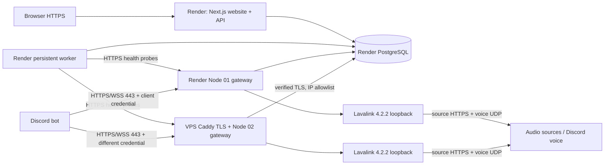

# Resonance — public Lavalink service

Layanan dua node dengan dashboard Next.js/TypeScript/Tailwind, backend API di Next.js, PostgreSQL, gateway kredensial per client, dan worker monitoring persisten.

**Status: implementasi dan pengujian lokal, belum layanan produksi yang terverifikasi.** Node 01 harus berada di Render dan Node 02 di VPS. Repo ini tidak dapat membuktikan jaringan Render/VPS atau audio Discord tanpa deployment, token bot, channel uji, dan listener. HTTPS 443 hanya jalur kontrol; voice Discord menggunakan koneksi dan UDP keluar terpisah.

## Hasil pengujian saat implementasi

- Lavalink resmi **4.2.2**, youtube-plugin **1.18.2**: berhasil startup lokal pada Java 17; info, stats, REST dan WebSocket diuji.
- PostgreSQL nyata + Next API + gateway: registrasi/login, CSRF, isolasi role dan sesi, kredensial per node, kuota atomik, kontrol player, resume, revoke, serta worker diuji. Kontrol player tanpa Discord voice **bukan** tes audio.
- Pencarian YouTube menghasilkan 20 track; SoundCloud 10 track; decode berhasil. Satu URL YouTube langsung (`aqz-KE-bpKQ`) menghasilkan `loadType=error`. Sumber tidak dijamin tersedia.
- **Belum terverifikasi:** playback audible, voice/UDP Render, deployment VPS/TLS, playlist dan TrackException pada koneksi voice nyata. Laporan runner yang kekurangan secret bertanda BLOCKED dan keluar dengan kode 2.
- Lihat [docs/verification.md](docs/verification.md) untuk matriks dan langkah penerimaan.

## Arsitektur



Satu instance gateway dan Lavalink per identitas node. Session Lavalink berada di memori instance, bukan PostgreSQL. Jangan menambah replica node yang sama di belakang load balancer. Restart dapat memerlukan player/voice session baru. Web dan worker boleh menjalankan deploy terpisah; worker memakai advisory lock PostgreSQL untuk mencegah duplikasi.

## Struktur direktori

```text
app/                       Next.js pages, loading/error states, API routes
components/                Shell, public telemetry, auth/account/admin, docs
lib/                       PostgreSQL, auth, security, gateway policy, bot client
services/gateway.ts        Public REST/WSS → internal Lavalink; auth and telemetry
services/monitor.ts        Persistent 30-second probes, retention, incidents
scripts/migrate.ts         Transactional, locked SQL migrations
scripts/admin.ts           Bootstrap role for an existing registered account
scripts/playback.ts        Staged live Discord integration runner + JSON evidence
examples/bot.ts            Owner-only Discord commands and same-node reconnect
tests/                     Security + real PostgreSQL/API/Lavalink integration
application.yml            Shared pinned Lavalink configuration, secrets from env
deploy/vps/                Separate Node 02 Compose, Caddy TLS and env template
render.yaml                Node 01, web/API, background worker, Render PostgreSQL
db/migrations/             Database schema
Dockerfile, start.sh        Supervised gateway + official Lavalink container
.env.example               Environment variable reference
package.json, package-lock.json
```

## 1. Development

Requires Node 24, npm 11, PostgreSQL 15+, Java 17+ for local Lavalink or Docker Engine + Compose. Use the lockfile:

```bash
npm ci
cp .env.example .env
# Fill DATABASE_URL, APP_ORIGIN, SESSION_SECRET; use private file permissions.
chmod 600 .env
# For npm scripts, export variables in the process environment or use a secret manager.
set -a
source .env
set +a
npm run migrate
npm run dev
```

Use `APP_ORIGIN=http://localhost:3000` for local website development; production must use the exact HTTPS origin. `DATABASE_SSL=false` is only for local PostgreSQL or Render's internal private network. VPS must use the external Render DB URL with `DATABASE_SSL=true` and verified certificates. No certificate-verification bypass is included.

Production web build: `npm run build`, then `npm start -- --port "$PORT"`. Separate worker: `npm run monitor`. `/api/health` checks PostgreSQL; `/api/public` returns aggregate telemetry. Missing data is `null`/UNKNOWN, with no sample seed statistics in the dashboard.

Register a real operator account, then bootstrap through a trusted server shell:

```bash
npm run admin -- your-registered-address@example.com
```

No default admin account/password exists. Admin approves audio access; account can create up to four client credentials. Set the operator identity/contact channel in service policy before public launch; policy text is an operational template.

## 2. Required environment variables

| Process | Variables | Notes |
|---|---|---|
| Website/API | `DATABASE_URL`, `DATABASE_SSL`, `APP_ORIGIN`, `SESSION_SECRET` | SESSION_SECRET: independent random 32+ characters; HTTPS origin in production |
| Worker | `DATABASE_URL`, `DATABASE_SSL`, `NODE_RENDER_URL`, `NODE_VPS_URL`, `MONITOR_RENDER_TOKEN`, `MONITOR_VPS_TOKEN` | URLs must be HTTPS origins, without path/query/credentials |
| Each gateway | `DATABASE_URL`, `DATABASE_SSL`, `NODE_ID`, `LAVALINK_SERVER_PASSWORD`, `MONITOR_TOKEN`, `PORT`, `SERVER_PORT` | NODE_ID `render` or `vps`; both passwords/tokens distinct per node, 32+ characters |
| VPS Caddy | `VPS_DOMAIN`, `ACME_EMAIL` | Real DNS domain; Caddy obtains/renews certificates |
| Bot | `DISCORD_TOKEN`, `DISCORD_GUILD_ID`, `DISCORD_VOICE_CHANNEL_ID`, `BOT_OWNER_ID`, `LAVALINK_URL`, `LAVALINK_CLIENT_KEY` | Client key from dashboard, never the internal password |
| Live runner | Bot variables except BOT_OWNER_ID + `TEST_TRACK_IDENTIFIER`, `TEST_SEARCH_IDENTIFIER`, `TEST_PLAYLIST_IDENTIFIER`, `TEST_EXCEPTION_IDENTIFIER`, `PLAYBACK_NODE_ID` | See verification guide; omissions never auto-pass |
| Evidence | `PLAYBACK_REPORT_DIR`, optional `RECORD_PLAYBACK=true` + `DATABASE_URL` | Server/operator-only DB write; human audible flag is not automatically inferred |

Generate each secret independently with `openssl rand -hex 32`. Store through Render environment/secret management or a root/operator-readable private `.env` on VPS. Never use `NEXT_PUBLIC_` for secrets. Node secrets and database URLs never appear in the browser. The **client credential** is intentionally shown once to its authenticated owner and then stored only as SHA-256 hash.

`LAVALINK_HTTP_ENABLED` defaults false. Only enable arbitrary HTTP sources in an isolated test fixture environment with egress restrictions. Otherwise clients could make your audio server access unintended network resources. Voice endpoints are limited to Discord's `*.discord.media` domain.

## 3. Render deployment (Node 01 + website/API + PostgreSQL)

1. Create a Blueprint from `render.yaml`. Services use paid persistent plans; the worker is a separate `type: worker`. Review the actual plan availability/pricing in your Render account.
2. Set `APP_ORIGIN` to the website HTTPS origin. Fill both node HTTPS URLs, unique gateway internal password, and matching monitoring secrets. Copy monitoring tokens into the worker's matching variables.
3. Web `preDeployCommand` and worker startup run the migration safely under a PostgreSQL advisory lock. Gateway may fail health until the initial migration completes; redeploy it after DB readiness if necessary.
4. Render discovers gateway `PORT=10000`; Lavalink only binds `127.0.0.1:2333`. Public connections use `https://<node>.onrender.com:443` and `wss://<node>.onrender.com:443/v4/websocket`. Website HTTPS is provided by Render. Configure custom-domain DNS using the assigned Render targets.
5. Keep exactly one Node 01 instance. Check `/healthz`, then authenticate REST and WebSocket with an approved per-node client key. Health alone does not prove playback.
6. Run the **Render live playback gate** below on this exact instance. Do not label it playback-ready without evidence.
7. Enable a Render PostgreSQL backup/recovery policy appropriate to your plan; periodically test restoring to a separate database. Migrations are forward-only, and should be preceded by a backup before later schema changes.

### Render network gate

[Render documents WebSocket support](https://render.com/docs/websocket) and [single public port binding](https://render.com/docs/web-services#port-binding). Those statements support the REST/WSS design. They do not establish that Discord UDP or a particular music source works from your selected service/region/plan.

Verify on the deployed Node 01:

- Source DNS and HTTPS access, valid track resolution, stream fetch (not only search metadata).
- Discord voice WebSocket handshake, current encryption/DAVE compatibility, UDP discovery and sustained outbound voice packets.
- A human listener hears audio while player position advances; pause/resume/stop work audibly.
- Reconnect, deploy/restart, and a maintenance outage recovery.
- Latency, frame statistics when available, request errors, and resource use under expected concurrency.

Use private node logs and, if the platform permits, packet capture on your own deployment. If UDP cannot be diagnosed from the container, ask Render support about the chosen service and retain the result with the live report. **This implementation has no Render network test result yet.**

If Node 01 cannot play reliably, keep website/API/PostgreSQL on Render and propose moving its audio process to a second VPS or VM with verified outbound UDP. That changes the user's mandatory Node 01 location; record the incompatibility and obtain that deployment decision. Do not silently present a proxy on Render to a VPS as a working Render Lavalink node.

## 4. VPS Node 02 with TLS

See [docs/vps.md](docs/vps.md). Use `deploy/vps/compose.yaml` and `Caddyfile`; `install-vps.sh` expects Docker already installed and never overwrites secrets/firewall rules. Node identity, hostname, and internal password are separate from Render.

Port 80 is solely for certificate issuance/redirect. **Never send Authorization or Lavalink passwords to HTTP port 80**, including requests expected to redirect. Encryption starts only after TLS; redirects cannot recover an already exposed credential. Bot/worker URL validation rejects public HTTP origins.

## 5. Authentication, quotas & revocation

- Website: scrypt password hashes, random 7-day server-side sessions stored as hashes, HttpOnly/SameSite cookies, Secure on HTTPS, Origin checks for every mutation, PostgreSQL rate counters.
- Public audio: operator-approved accounts issue node-bound random client credentials tied to a declared Discord bot user ID. Gateway substitutes the secret internal Lavalink password. Direct Lavalink port is never publicly exposed.
- Gateway ties each session to its credential and rejects another client's session access. Administrative/routeplanner endpoints are not public. Authentication and quotas fail closed when PostgreSQL is unavailable.
- Current quota: one WebSocket, five players, 120 REST requests/minute, 20,000 REST requests per 24-hour window per credential; four active credentials/account; volume 0–150. REST quotas use atomic PostgreSQL updates. These are enforced limits, not estimated capacity.
- Revocation immediately blocks new REST/WS requests. Heartbeat rechecks authorization every 15 seconds, destroys that session's players and closes the connection. If network/DB cleanup fails, Lavalink resuming timeout is capped at 60 seconds. DB lease expiry is 45 seconds after last heartbeat.
- Bot ID is **claimed by the client** and bound to the key, not verified ownership from Discord OAuth. Approval, operator review, and quota limits are the abuse controls. A leaked client key permits use of that grant until revoked.
- No automatic failover. Bot reconnects on the same node with bounded exponential backoff and resuming; it recreates voice/player after an unresumed session. Queue is in bot memory. Moving to another node is explicit and may restart tracks.

## 6. Monitoring and data definitions

Worker probes every 30 seconds, retries once after 500ms, with a 5-second timeout per attempt. `ONLINE`: valid stats and latency ≤1500ms. `DEGRADED`: valid stats but latency >1500ms. `OFFLINE`: both probes failed. `UNKNOWN`: configuration missing/invalid or newest sample older than 90 seconds. These are **control plane** statuses; audible evidence is separate.

- Players/playing: actual Lavalink `/v4/stats` counters. Connected clients: unexpired authenticated gateway WebSocket leases, excluding monitor requests.
- Daily active clients: distinct key IDs per node/day UTC seen connecting or renewing a lease. Multiple credentials can represent the same bot. Website accounts, Discord bots, players and Discord users are not equivalent. No claim of unique Discord users/bots is made.
- Latency: complete HTTPS health probe round trip, including gateway and stats query. CPU and RAM: Lavalink process load and JVM used/allocated bytes, not host RAM.
- Sampled uptime: ONLINE samples / all samples during last 24h. Coverage: sample count / 2880 expected 30-second samples. Gaps do not imply uptime. Timestamp is visible; stale numbers are hidden.
- Request history: authenticated REST counts and errors per node/minute; error includes HTTP ≥400 and `loadType=error`. Track starts, ends and exceptions are separate WebSocket event counts. WS handshakes, health checks and denied unauthenticated requests are excluded.
- Retention: health checks/request buckets/client-day identities 30 days; audit logs 90 days; expired auth/rate/session leases cleaned by worker. Account/key metadata and incidents persist for operational history; operators handle account deletion and legal retention requests.
- Raw IP, track queries, Discord voice tokens, and credential values are not stored in monitoring. Application error logs use fixed event codes. Keep Lavalink/platform logs private; source libraries may include source diagnostic details.

## 7. Tests and operations

```bash
npm run typecheck
npm test
npm run build
# Disposable PostgreSQL database name MUST end in _test; suite resets it.
# Start official Lavalink separately and export its internal password.
DATABASE_URL=postgresql://.../resonance_test npm run test:integration
# Actual Render and actual VPS: separate runs, with private credentials exported.
PLAYBACK_NODE_ID=render npm run test:playback
PLAYBACK_NODE_ID=vps npm run test:playback
```

Integration tests use real PostgreSQL, Next.js and Lavalink; they do not simulate Discord audio. Live runner requires a supported playlist and a controlled source that fails **after load** to exercise TrackExceptionEvent. Exit codes: 0 all stages observed, 1 at least one failed, 2 blocked/incomplete. Human listening requires interactive `HEARD`; environment variables cannot auto-pass it. Optional `RECORD_PLAYBACK=true` records evidence in PostgreSQL for the admin/public audible timestamp.

See [docs/verification.md](docs/verification.md) for operational troubleshooting and the full acceptance checklist. No production DNS, Render resource, VPS, or Discord bot has been created by merely applying this repository.

### Validasi akhir lokal

Tujuh unit test dan sepuluh skenario integrasi (11 tests termasuk parent) lulus, termasuk bootstrap admin aktual. Typecheck, build Next, audit dependency produksi (0 vulnerabilities), Docker build/readiness, Compose, Caddy config, dan alur browser desktop/mobile lulus. CodeRabbit review diblokir karena dinonaktifkan pada task. Pengujian deployment/TLS publik dan audio Discord tetap BLOCKED.
